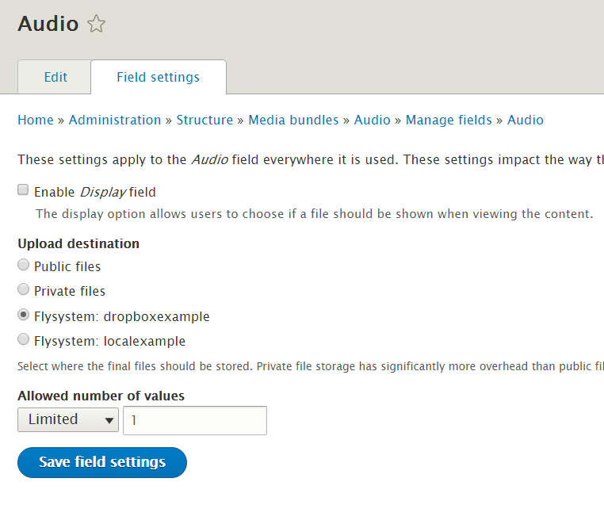

# Flysystem

The [Flysystem](https://www.drupal.org/project/flysystem) module is the first remote storage solution to be available for Drupal 8 (and it's also recently available in D7). It uses the [Flysystem PHP library](http://flysystem.thephpleague.com/), a modern filesystem abstraction designed to allow for the easy swapping of one filesystem with another. The Flysystem library is gaining widespread adoption in the PHP world, and is the default filesystem layer in the Laravel framework. Incorporating it in a Drupal project is an example of the "getting off the island" or "proudly invented elsewhere" philosophies often discussed for Drupal 8 - making use of the work done in the wider PHP community rather than struggling to reinvent everything from scratch.

Flysystem is made available in Drupal 8 by the [Flysystem module](https://www.drupal.org/project/flysystem). Currently through its adapter modules it offers the following storage types:
* Local
* (s)FTP
* ZIP
* Dropbox
* Rackspace
* Amazon S3
It's relatively easy to implement new adapters, and more are becoming available all the time.

When joined with a flysystem adapter module, the flysystem module offers four things:
* a syntax to define the access details for the remote storage location in Drupal's settings.php.
* a storage setting for Drupal's core file field.
* access to the Flysystem API so you can execute standard file system operations (read, write, list, etc.) on your remote storage from your custom code.
* a synchronisation UI that enables you to manually synchronise local and remote storage locations.

# Simple remote storage with Flysystem

Firstly, install Flysystem module and an adapter module e.g. Flysystem_dropbox

Secondly, specify the remote storage location in Drupal's settings.php

```php
    $schemes = [
        'dropboxexample' => [
            'driver' => 'dropbox',
            'config' => [
               'token' => '#my-dropbox-token#',
               'client_id' => #my-dropbox-email-id#,
               'prefix' => '[/dropbox subdirectory]', // Optional.
            ],
        ],
    ]
    $settings['flysystem'] = $schemes;
```

* Choose Flysystem location as the storage for a Drupal file field



If you upload a file in Drupal using that file field, it will then be stored on your remote location, not on the web server where Drupal runs.

When the file field is rendered by Drupal (e.g. because the content or media entity having that file field is requested by a site visitor) then the file will be served up to your visitor, exactly as if it were stored on your server. All the Drupal field formatters, theming, etc. work exactly as normal.

## File access control

Flysystem storage works like private files in drupal 8. It restricts access to the original files and lets Drupal and its modules control access to the files.

Instead of rendering a URL directly to a file at its location (e.g. https://mybucket.s3.amazonaws.com/myfile.mp3), it renders instead a URL on your webserver (e.g. http://mywebserver.com/system/files/myfile.mp3). Requests to this URL are intercepted by Drupal, which uses its standard and configurable access control logic to decide whether or not to return the file or an "Access denied" message.

By default when using a file field, anyone who can access the entity to which the file field is attached will be able to access the file at its URL. If they logout or have their permissions changed, they won't be able to access the file even if they made a copy of its URL.

The situation is slightly more complicated with images - [see here for more](https://www.drupal.org/node/2541116).

## Bandwidth

One issue to be aware of with Flysystem is that as it is not handing out a direct URL to the third party server, your web server is still involved in each request, and so there may be bandwidth or traffic implications for your web server if you serve up a lot of media.
@Todo: better information on this matter.
