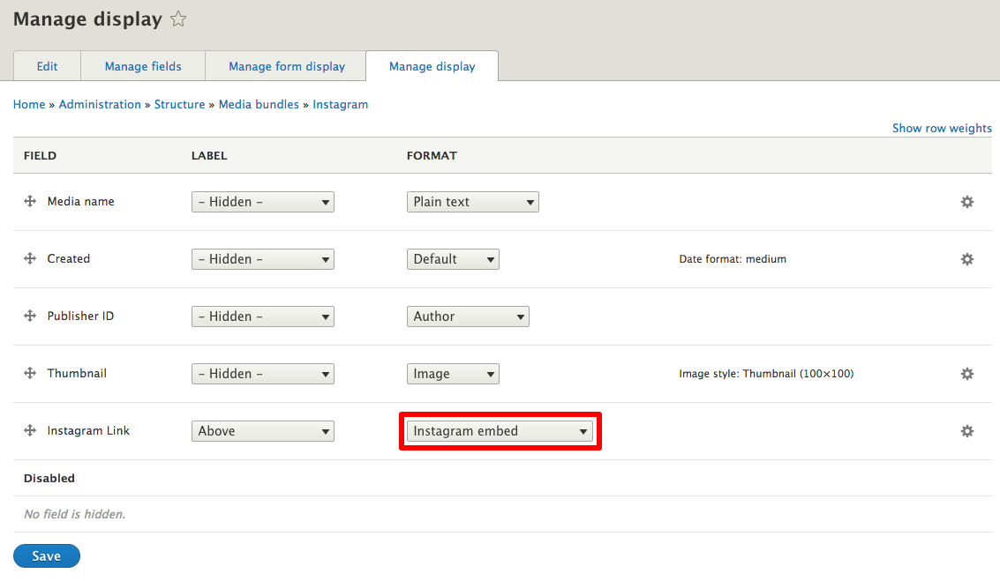
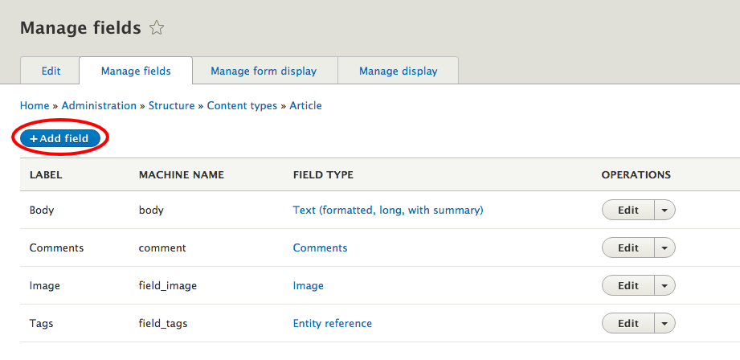
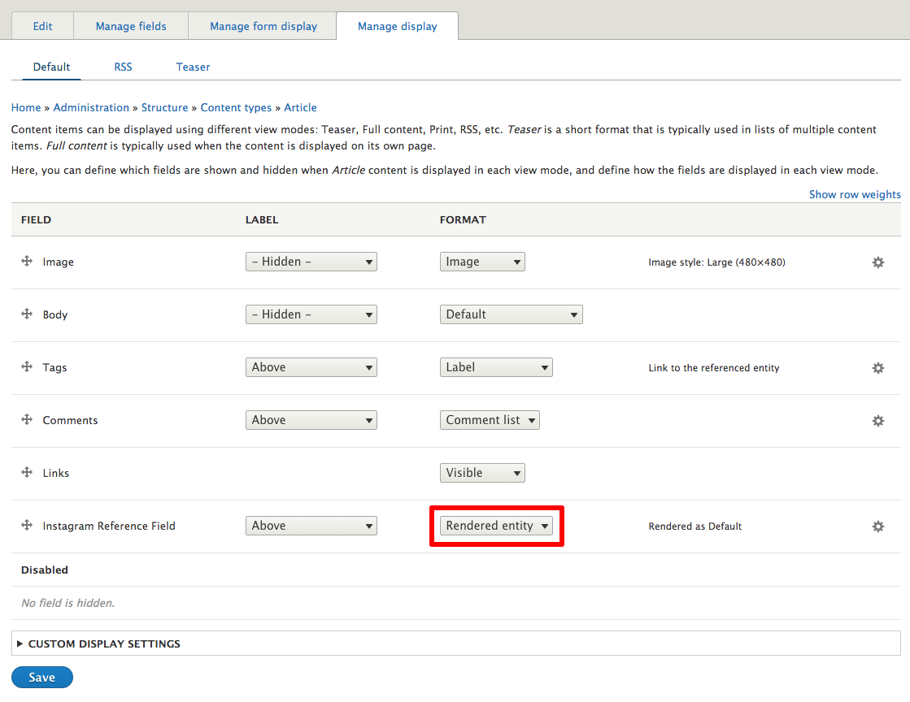
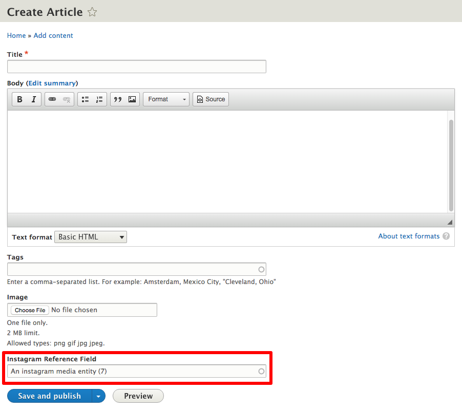

# Instagram

[Media Entity Instagram](https://drupal.org/project/media_entity_instagram) implements media entity resource provider for Instagram photos and videos.

## Requirements

1. [Media Entity](https://www.drupal.org/project/media_entity)

## Installation

1. Download [Media Entity](https://www.drupal.org/project/media_entity) from Drupal.org.
2. Download [Media Entity Instagram](https://drupal.org/project/media_entity_instagram) from Drupal.org.
3. Install both Media Entity Instagram and Media Entity in the [usual way](https://www.drupal.org/documentation/install/modules-themes/modules-8).

## Usage

1. Create a Media bundle:
  * On `admin/structure` choose **Media bundles**.

    
  * Click on **+ Add media bundle**.

    
  * Fill *Label*, *Description* and *Type provider fields* for your media bundle and click **Save media bundle**.

    
2. Create an Instagram link field on a Media bundle:
  * On media bundles overview page choose **Manage fields** on created **Instagram** bundle.

    
  * Click on **+ Add field**. For a storage type choose **Link**, fill a *Label* field and click **Save and continue**.

    
  * Return to the bundle configuration and set "Field with source information" to use this new field.

    
  * On media bundles overview page choose **Manage display** on created **Instagram** bundle and select **Instagram embed** for the newly created field (*Instagram link* in our case) and then **Save**.

    
3. Create a Media entity:
  * On `admin/content/media` click on **+ Add media**.

    
  * Fill *Media name*, *Instagram link* fields similarly as it is displayed below and click **Save**.

    

    **Note:** Validation will fail if incorrect Instagram URL is provided and this also works with embed codes and plaintext fields, not just link field.
  * The created Instagram media entity is saved.

    
4. Add an entity (media) reference field on a content type:
  * On desired content type (i.e. Article), on `admin/structure/types`, click on **Manage fields**.

    
  * Click on **+ Add field**.

    
  * From **References** menu choose **Other**, fill the *Label* and click **Save and continue**.

    
  * Choose **Media** for **Type of item to reference** and click **Save field settings**.

    
  * Select **Instagram** bundle in **Reference type section** and click **Save settings**.

    
5. Open Manage display of your content type (in our case *Article*):
  * Select **Rendered entity** for the newly created field (*Entity media reference*) and then **Save**.

    
6. Create a new article with embedded Instagram post:
  * For an **Instagram reference** field choose a created entity Instagram entity.

    
  * The Instagram posts are displayed on the saved article page.

## Maintainers
- Janez Urevc ([@slashrsm](https://github.com/slashrsm)) (https://drupal.org/u/slashrsm)
- Malina Randrianavony ([@designesse](https://github.com/designesse/)) (https://www.drupal.org/u/designesse)

## Get in touch
- http://groups.drupal.org/media
- IRC: #drupal-media @ Freenode
