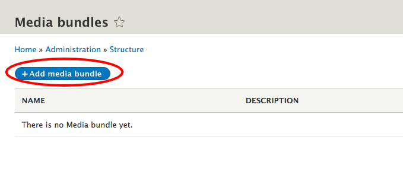
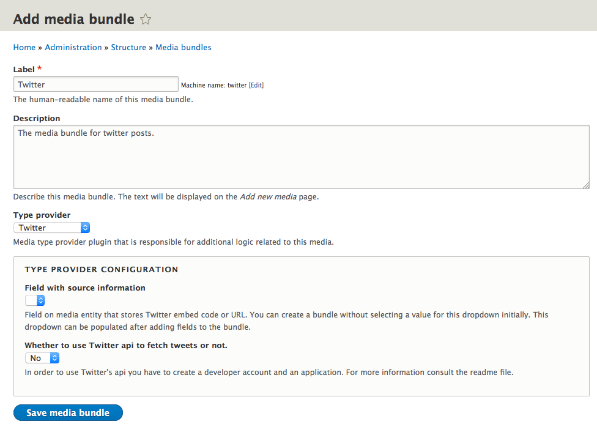
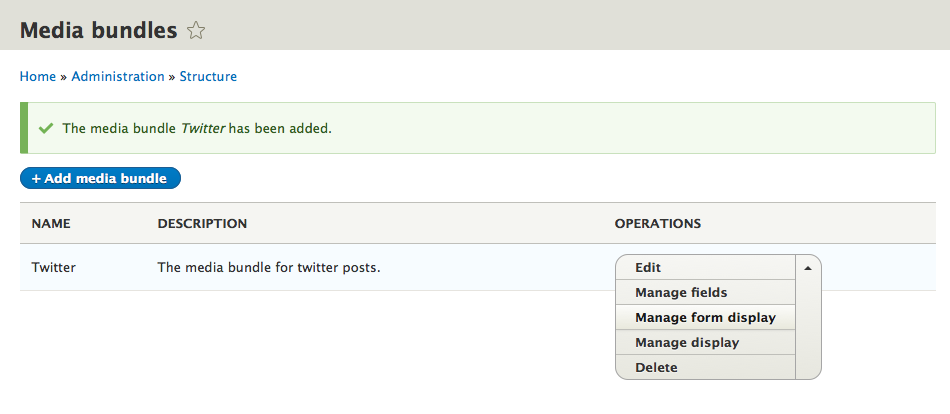
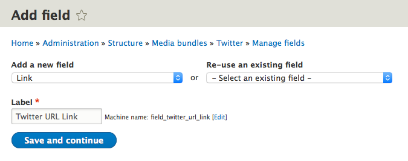
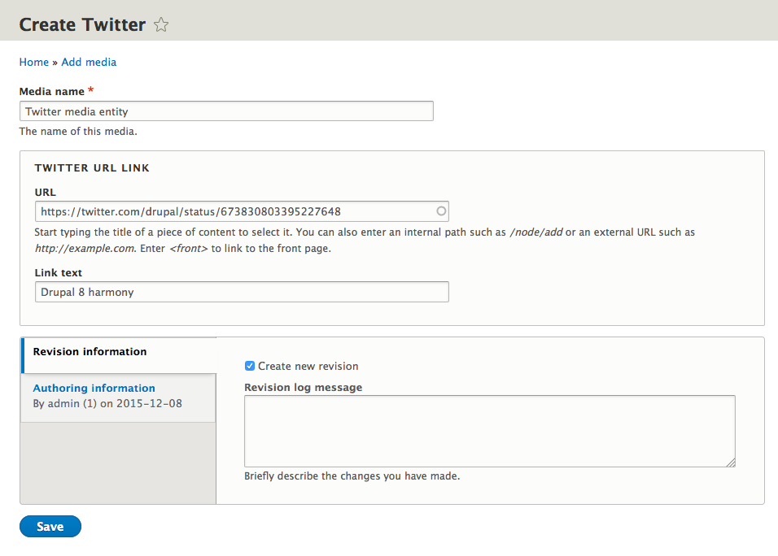
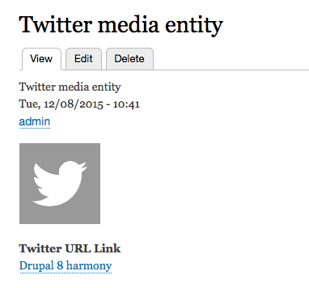
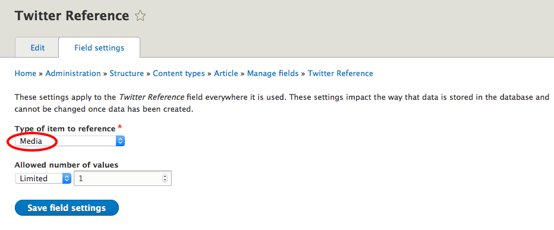
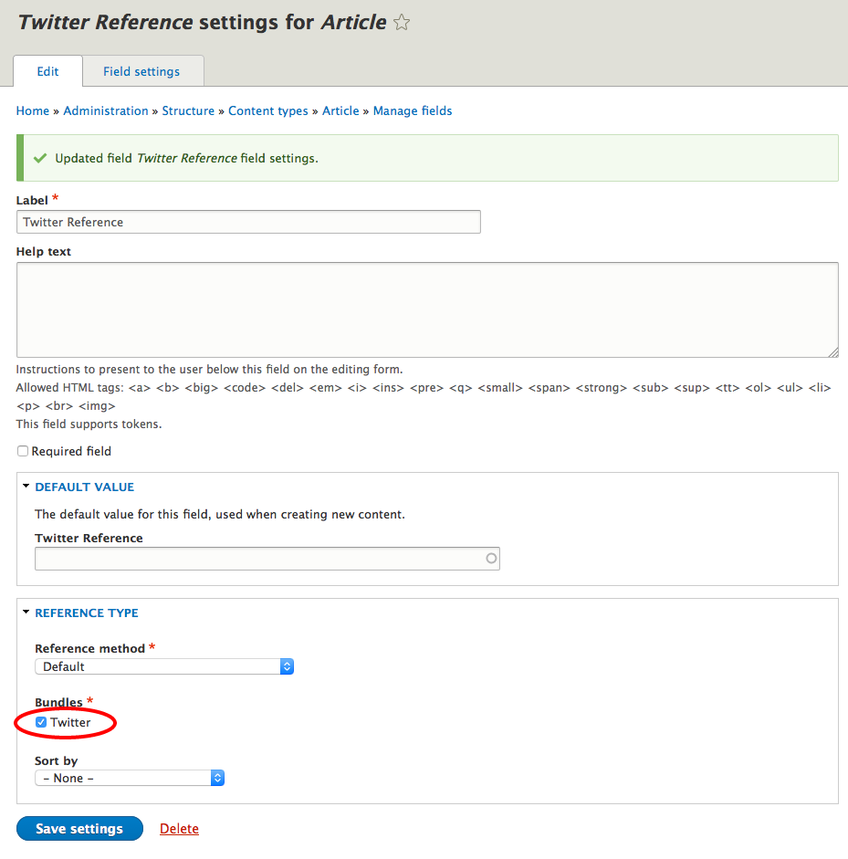
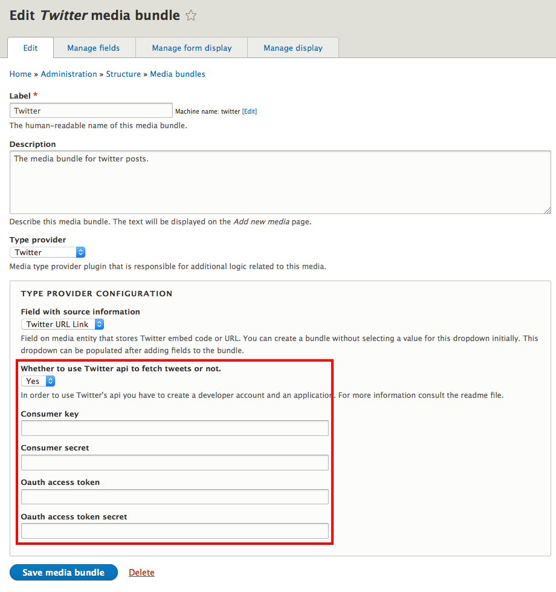
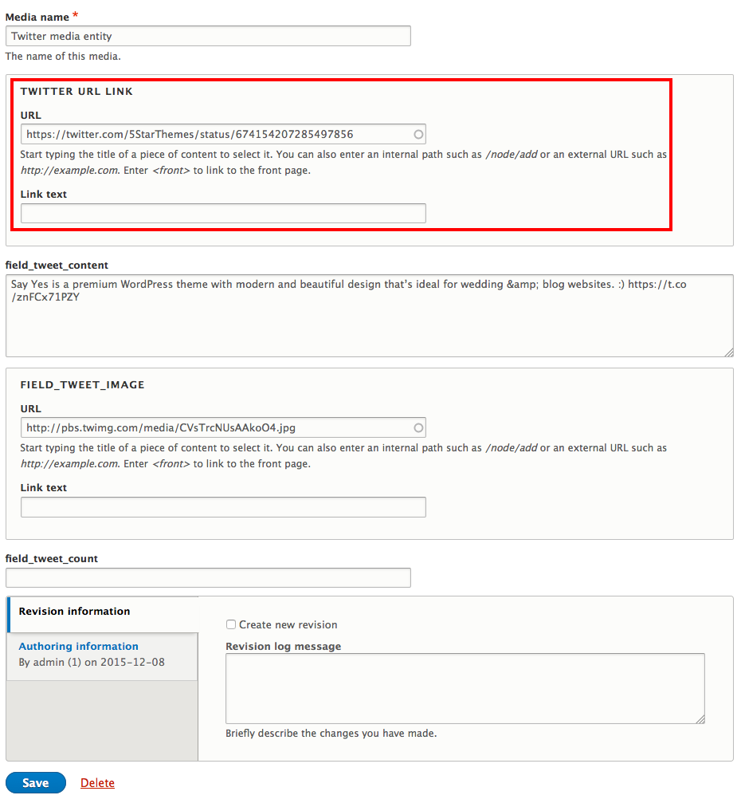

# Media Entity Twitter

[Media Entity Twitter](https://www.drupal.org/project/media_entity_twitter) provides Twitter integration for [Media entity module](https://www.drupal.org/project/media_entity) (i.e. media type provider plugin).

## Requirements

1. [Media Entity](https://www.drupal.org/project/media_entity)

## Installation

1. Download [Media Entity](https://www.drupal.org/node/2099473/release) from Drupal.org.
2. Download [Media Entity Twitter](https://www.drupal.org/node/2352799/release) from Drupal.org.
3. Install both Media Entity and Media Entity Twitter in the [usual way](https://www.drupal.org/documentation/install/modules-themes/modules-8).

## Usage

### Without Twitter API

If you need just to embembed tweets you can use this module wihout using Twitter's API. That will give you access to the fields available from the url/embed code: id and user.

1. Create a Media bundle
  * On `admin/structure` choose **Media bundles**

    
  * Click on **+ Add media bundle**
  
    
  * Fill *Label*, *Description* and *Type provider fields* (for type provider choose "Twitter") for your media bundle and click **Save media bundle**
  
    
2. Create a Twitter link field on a Media bundle
  * On media bundles overview page choose **Manage fields** on created **Twitter** bundle.
  
   
  * Click on **+ Add field**. For a storage type choose **Link** (for URL) or **Text (plain)** (for embed code), fill a *Label* field and click **Save and continue**.
  
   
3. Return to the bundle configuration and set "Field with source information" to use this new field.

   
4. Create a Media entity
  * On `admin/content/media` click on **+ Add media**
  
   
  * Fill *Media name* and *Twitter url link* fields similarly as it is displayed below and click **Save**.
  
   
  * The created Twitter media entity is saved.
  
   
5. Add an entity (media) reference field on a content type
  * On desired content type (i.e. Article), on `admin/structure/types`, click on **Manage fields**
  
   
  * Click on **+ Add field**
  
   
  * From **References** menu choose **Other**, fill the *Label* and click **Save and continue**
  
   
  * Choose **Media** for **Type of item to reference** and click **Save field settings**
  
   
  * Select **Twitter** bundle in **Reference type section** and click **Save settings**
  
   
9. Create a new article with embedded Twitter posts
  * For an **Twitter reference** field choose a created entity Twitter entity.
  
   
  * The Twitter post is displayed on the saved article page.

### With Twitter API

If you need to get other fields, you will need to use Twitter's API. 

**IMPORTANT:** beware that there is limit on the number of request that can be made for free. [Read more](https://dev.twitter.com/rest/public)

To get this working follow the steps below:

1. Download and enable [composer_manager](https://www.drupal.org/project/composer_manager)
2. Run the module's init.php script on the command line (`php scripts/init.php` from inside the composer_manager module directory)
3. Run `composer drupal-update` from the root of your Drupal directory
4. Create a twitter app on the twitter [developer site](https://dev.twitter.com/apps/)
5. Enable read access for your twitter app
6. Grab your access tokens from the twitter developer site
7. In your Twitter bundle configuration set "Whether to use Twitter api to fetch tweets or not" to "Yes"" and paste in the "Consumer key", "Consumer secret", "Oauth access token" and the "Oauth access token secret".

  
8. If you want to store the fields that are retrived from Twitter you should create appropriate fields on the created media bundle (image, content and retweet_count by repeating **Step 2** from "Without Twitter API" section and map these fields to the fields provided by Twitter.php.

**NOTE:** At the moment there is no GUI for that, so the only method of doing that for now is via CMI.

This whould be an example of that (the field_map section):

```
uuid: 834c7564-894f-4d5e-9808-8b1785322099
langcode: en
status: true
dependencies:
  module:
    - media_entity_twitter
id: twitter
label: Twitter
description: 'The media bundle for twitter posts.'
type: twitter
type_configuration:
  source_field: field_twitter_url_link
  use_twitter_api: '1'
  consumer_key: YOUR_CONSUMER_KEY
  consumer_secret: YOUR_CONSUMER_SECRET
  oauth_access_token: YOUR_OAUTH_ACCESS_TOKEN
  oauth_access_token_secret: YOUR_OAUTH_ACCESS_TOKEN_SECRET
field_map:
  source: field_twitter_url_link
  content: field_tweet_content
  image: field_tweet_image
  retweet_count: field_tweet_count
```
9. After you add fields on your media bundle (in this example these fields are: field_tweet_content, field_tweet_image and field_tweet_count) and import your yml structure (on `admin/config/development/configuration/single/import`) to correspond to your media bundle created in **Step 1** in "Without Twitter API" section, only thing you need to do is to fill **Twitter URL Link** field in your Media entity created in **Step 4** in "Without Twitter API" section and all the other fields will be automatically filled with proper values when saving Media entity.

  

## Sponsors

- [www.examiner.com](http://www.examiner.com/)

## Maintainers
- Janez Urevc ([@slashrsm](https://github.com/slashrsm)) (https://drupal.org/u/slashrsm)
- Primož Hmeljak ([@primsi](https://github.com/primsi)) (https://drupal.org/u/primsi)

## Get in touch
- http://groups.drupal.org/media
- IRC: #drupal-media @ Freenode
